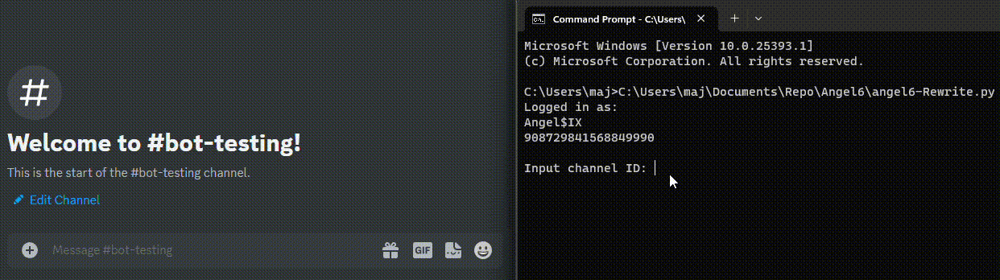

# Angel$IX

  

## Introduction

Discord bot written in Python, works with NextCord and PyCord, does **not** use slash commands, invoked with "~" or by mentioning the bot

**Mostly usable as of v2.2.2, with ongoing improvements.**

## Bot Functionality

Angel$IX is a versatile Discord bot with the following features:

- Music: Play and manage music in voice channels.
- Fun: Enjoy random cat images, femboy wisdom/tutorial, GIFs, roll dices.
- Moderation: Kick, ban, mute, and warn users.
- Utility: Show bot statistics, display server invites, get information about the server and more.
- Misc: perform various logging functions (**experimental**), check server statistics and show bot's uptime.
- And more!

Please note that this is not an exhaustive list, and the bot may have additional commands or features. For a complete list of commands and detailed usage instructions, refer to the bot's documentation or use the help command in Discord.

<h2>Usage:</h2>

To set up and run Angel$IX for the first time, follow these steps:

1. Make sure you have **Python 3.11+** installed.
    > it may work with older python versions however I offer **no** support for those nor do I guarantee compatibility
    
2. Clone the repository and navigate to the project directory.

3. Install the required dependencies by running the following command:
    > `pip install -r requirements.txt`
    
4. Rename the `.env_example` file to `.env` and make sure to add your `token`.

5. Run the `angel6-rewrite.py` script using the following command: `python angel6-rewrite.py` (depending on the OS you may need to launch it with `python3`)
   > **Note**  
   > The script will perform the first time setup, where you'll be prompted to input various channel IDs.

6. Once the setup is complete, the bot will automatically reboot. You'll see the message "Setup complete, Rebooting" in the console.
    > **Warning**  
    > If the bot goes back to the input logging/join/leave/general channel ID restart the bot manually.  
    > But if it shows `Input channel ID: ` this is okay as it's the channel selector for talking thru the bot

7. The bot is now ready to use. It will log in to Discord and display information about its settings and status.

    - The bot version will be displayed.
    - The logging channel, join/leave channel, and general channel will be mentioned.
    - The API latency will be shown.
    - Credits and additional information may also be sent to the logging channel.

8. You should now be able to interact with the bot using its available commands in Discord.

## TO-DOs:

- [ ] Add ytdl playlist support (not heavily requested/used).
- [ ] Use slash commands
- [ ] Add API search support
- [ ] Add more APIs
- [ ] Put logging functions into main file
- [ ] Put warns, kicks and bans into a Json 

## Planned Changes by 2.5.0:

- [ ] Use Cogs more
- [ ] Add more Moderation logging
      
  - [x] Ban logging
  - [x] Unban logging
  - [x] Message edit logging
  - [x] member update logging

- [ ] Log errors to a channel 
- [ ] Verify support for Python 3.12
- [ ] Add gifadd command and make giflist a separate json file

<h2>Gallery:</h2>

  

    
Ping:

    
  

  
  

    
Gifs:

    
  

  
  

    
Chat thru the bot:

    
  

  
  

    
Enable/disable Asbot extension:

    
  

  
  

    
On bootup:

    
  

  
  

    
Stats:

    
  

  
  

    
Roll:

    
  

  
  

    
Serverinfo:

    
  

  
  

    
Userinfo:

    
  

  
  

    
Deleted messages logging:

    
  

  

<h2>Links:</h2>

### Here are some useful links related to Angel$IX or me:

Join the official [Discord](https://discord.gg/Ry2HqGqT2K) server for support related to Angel$IX.

Follow me on [Twitter](https://twitter.com/may113_Mutiny) for the latest news and announcements. 

Feel free to explore these links to stay updated with the latest news and announcements!

